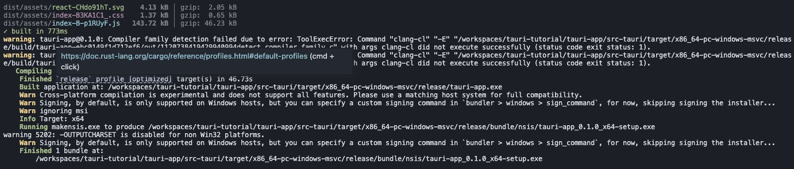

# tauri-tutorial

[Linux(WSL2)からTauriアプリをWindows向けにクロスコンパイルする(Experimental)](https://zenn.dev/junkor/articles/69ad2422b8067f)

## Development
```
$cd ./tauri-app
$ yarn dev
```

Open [http://localhost:1420/](http://localhost:1420/)

## To run the app for development on the browser
```
$ cd ./tauri-app
$ yarn tauri dev
```

## To build the app for Windows
```
$ cd ./tauri-app
$ ./build.sh
```


